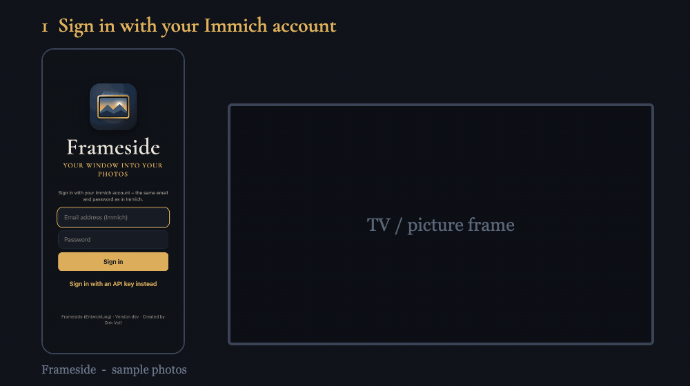

# Immich Showcase

<p align="center"></p>

**Show your [Immich](https://immich.app) photos on the TV and on a picture frame – and let the whole family do it from their phone.**
Search in plain sentences ("Grandma and Anna, Christmas 2019, on the beach"), tap the photos you like, give the show a name and send it to the living-room TV or the picture frame in the hallway. Optional background music, videos, and a continuous slideshow when nobody has asked for anything.

🇩🇪 [Deutsche Anleitung](README.de.md)

> Immich Showcase is an independent community project. It is not affiliated with, endorsed by, or part of the Immich project. "Immich" is the name of the software it works with.

<p align="center"><br><sub><em>(Walkthrough built from the screenshots below; all photos are invented samples.)</em></sub></p>

| Sign in | Latest photos | Selection | Send to TV |
|---|---|---|---|
|  |  |  |  |

| Remote control | Search in sentences |
|---|---|
|  |  |

The picture frame (continuous programme with blurred background, date, place and clock):


With weather and appointments at the top right, device pairing by code/QR on the TV, and the Devices view in the app:

| Frame with weather and appointments | Pair a device (TV/tablet) | Devices view |
|---|---|---|
|  |  |  |

*(All screenshots use invented sample photos.)*

## What it does
- **Search in whole sentences** in five languages: people, time, place, motif.
- **Linked filters** (person, year, country, photos/videos), "select the whole day", undo.
- **Shows:** save, name and restart them later.
- **TV:** a web page you open once in the TV browser (LG webOS, Android TV, Shield, Chromecast with browser …). Control it from the phone: pause, next/previous, music, stop. Videos are converted in advance so the TV can play them.
- **Picture frames:** an own player for any tablet – **a plain browser is enough** ([Fully Kiosk](https://www.fully-kiosk.com) is an optional extra). Without a request it shows a continuous programme with a clock; a show from the app interrupts it, "Stop" brings the programme back. **Several frames** are supported: add and set them up in the app (programme sources, schedule, night rest, Fully Kiosk), send a show to one or more of them, or give each frame its own show.
- **Background music** from your own folders (none is included).
- **Safe by design:** the app can never delete a photo, runs as non-root in a read-only container, and every person can use their own Immich account.

## What you need
- A running **Immich** (tested with 3.2.x) and a user account on it.
- A machine with **Docker + Docker Compose** (NAS, mini PC, Raspberry Pi – images for amd64 and arm64).
- For the picture frame: a **tablet** (or any device with a browser). For the TV: a TV with a web browser.

## Installation (about 5 minutes)

> 📖 **With screenshots, step by step:** [Getting started – illustrated guide](docs/anleitung.md) · [Showcase on a different machine than Immich, e.g. Raspberry Pi](docs/anleitung-externer-rechner.md) (both German)

**One command** on the machine that runs Docker (Linux, NAS, mini PC; a Raspberry Pi works too):

```bash
curl -fsSL https://raw.githubusercontent.com/dirkvoss/immich-showcase/main/install.sh | bash
```

The script
- downloads Immich Showcase to `~/immich-showcase`,
- **detects Immich** if it runs on the same machine in Docker and attaches the app to its Docker network (no file to edit),
- starts everything and prints a **ready-made setup link** at the end (with a QR code if `qrencode` is installed) that you open in the browser.

The **setup wizard** has three short steps:
1. **Connect Immich:** Immich is usually found automatically. Otherwise enter its address (e.g. `http://192.168.1.10:2283`).
2. **Sign in** with your Immich account (email + password). Immich Showcase creates its own API key **without delete rights**; your password is not stored.
3. **Who may use it?** **Shared PIN** (recommended; at home optionally without typing it) or **Immich accounts** (everyone only sees their own photos).

At the end the page shows a **QR code for the iPhone app** and the address for TVs and tablets. Then enter the code shown on the TV or tablet in the app under "Devices". A "First steps" list in the interface guides you until everything works.

More ways:
- **No Immich yet?** `./install.sh --with-immich` starts Immich **and** Immich Showcase together.
- **Different port:** `./install.sh --port 80` (then the TV only needs the plain IP address).
- **By hand** (no script): `cp .env.example .env`, `docker compose up -d`, `docker compose logs showcase` shows the setup code, then open `http://<server>:8090/setup/`. Prefer no wizard? Put `RAHMEN_IMMICH_URL` and `RAHMEN_IMMICH_KEY` into `.env`; values from `.env` always win.
- **NAS and home servers with a UI:** ready-made guides for **Synology** (Container Manager), **Unraid** (template), **TrueNAS** and **Portainer** are in `examples/`.
- On the iPhone without the app: Share → "Add to Home Screen". With the app: "Showcase Immich" from the App Store or TestFlight; it **finds the server on your Wi-Fi by itself**.

## What can be used as a picture frame?
Any device with a **web browser** that can open an address. **A kiosk mode or add-on apps such as Fully Kiosk are not required** – the browser is enough. The page asks the browser to keep the screen awake; where that does not work, set the device's auto-lock to "Never". A kiosk mode (full screen, nothing else reachable) is only a convenience you can add if you like.

| Device | How |
|---|---|
| **Raspberry Pi + any monitor/TV** (cheapest permanent solution) | `./examples/raspberry-pi/setup-kiosk.sh http://<server>:8090/tv/` – installs Chromium in kiosk mode and starts it on power-up (see below) |
| **Android tablet or old phone** | Free and sufficient: Chrome → open the address → "Add to Home screen" → open it from there (full screen) and set the screen timeout to "never". *Optional:* [Fully Kiosk](https://www.fully-kiosk.com) (about 8 € once) really switches the screen off at night and reports the battery level |
| **iPad / old iPhone** | Safari → open the address → Share → "Add to Home Screen"; use **Guided Access** (Settings → Accessibility → Guided Access) as kiosk mode and set Auto-Lock to "Never" |
| **TV, Fire TV, Android TV, Chromecast with Google TV, Shield** | open the browser, enter the address, bookmark it |
| **Old laptop / mini PC** | Chrome with `--kiosk <address>` in autostart |

Use `http://<server>:8090/tv/` **without** `?ziel=…` to pair the device by code: it shows a code (and a QR code), you enter it in the app under **📡 Devices** and choose which TV/frame it is.

**Not supported:** ready-made frames with closed software (for example Aura, Skylight, Nixplay, Pix-Star, Frameo). They accept photos only through their own app or e-mail and do not let you open an address.

### Raspberry Pi in 5 minutes
1. Flash **Raspberry Pi OS with desktop** (Raspberry Pi Imager), enable Wi-Fi/SSH there, boot, let it log in to the desktop automatically.
2. On the Pi, in a terminal: `curl -O https://raw.githubusercontent.com/dirkvoss/immich-showcase/main/examples/raspberry-pi/setup-kiosk.sh && chmod +x setup-kiosk.sh && ./setup-kiosk.sh http://<server>:8090/tv/`
3. `sudo reboot`. The Pi starts full screen and shows the pairing code. Remove again with `./setup-kiosk.sh --entfernen`.

*The Raspberry Pi script was written for Raspberry Pi OS (Bookworm) but has not been tested on every Pi model – feedback is welcome.*

## Set up a TV
1. In `.env`: `RAHMEN_WEB_TV_ZIELE=livingroom=Living room` (`id=Display name`, comma-separated for several TVs).
2. `docker compose up -d`
3. On the TV, open the browser at `http://<server>:8090/tv/?ziel=livingroom` and bookmark it. Leave the page open – it shows "ready" and waits.
4. On your phone: select photos → **On TV** → choose the TV, time per photo, order, music → **Start**.

## Set up a picture frame
1. In `.env`: `RAHMEN_WEB_RAHMEN_ZIELE=frame=Picture frame`
2. Choose what the frame shows when nobody asks for anything (`RAHMEN_WEB_RAHMEN_*`, all optional):
   - **Albums:** `RAHMEN_WEB_RAHMEN_ALBEN=<album-id>,<album-id>` (ids from the Immich album URL)
   - **Marker albums:** `RAHMEN_WEB_RAHMEN_MARKER=1` – any album whose **description contains a tag with `frame`** (e.g. `#frame`, `#picture-frame`; German: `#rahmen`) joins the programme automatically. A tag like `#onlyframe` (German: `#nurrahmen`) shows **only** that album, in the order chosen in the app. Remove the tag to go back to normal.
   - **Weighted sources:** `RAHMEN_WEB_RAHMEN_QUELLEN=<album-id>:70, neu14:20, *:10` (an album, "uploaded in the last 14 days", the whole library – with weights)
   - Seconds per photo `RAHMEN_WEB_RAHMEN_SEK`, background `RAHMEN_WEB_RAHMEN_FUELLUNG` (`unscharf` = blurred, `zuschnitt` = crop, `balken` = black bars), caption `RAHMEN_WEB_RAHMEN_ANZEIGE=datum,zeit,ort`, night rest `RAHMEN_WEB_RAHMEN_NACHT=22:00-06:30`
3. `docker compose up -d`
4. On the tablet, open `http://<server>:8090/tv/?ziel=frame` in the browser (full screen) – if you use Fully Kiosk, set it as its start page.
   *Tip (Fully Kiosk):* if you use it as the **screensaver**, enter the address as the screensaver playlist item and restart the app once – Fully Kiosk only reads changes to the playlist after a restart.

**In the app instead of `.env`:** open **Devices** (📡) → **＋ Add device** to create frames and TVs and set them up (seconds per photo, background, caption, night rest, continuous programme sources, schedule, Fully Kiosk). The list is then stored in `rahmen_web_geraete.json` in the data folder and takes precedence over the variables above (they only serve as the starting point until the first change in the app).

**TVs without typing a long URL:** on the TV just enter the server address (for example `192.168.1.20:8090`, or only the IP with `./install.sh --port 80`) in the TV's browser – TV browsers (LG, Samsung, Android TV, Fire TV, Chromecast) are sent to the TV page automatically, which shows a code to pair in the app. The device wizard shows this short address, and you can edit it there. Advanced, for **Android TV / Shield / Fire TV** only: the server can open the page for you via ADB (device wizard → "Advanced: open directly on the TV via ADB"). This needs the developer feature "network debugging" (ADB) switched on at the TV – most devices have it off – and a network path from the server to the TV. For all other TVs the short address is the way.

**Settings in the app:** Account menu → **⚙ Settings** covers defaults for all frames, weather location and calendar link (with test), Pushover notifications, nicknames for people and the TV page address. Values saved there take precedence over the environment variables; anything security-related (sign-in mode, trusted network, proxies, Immich key) stays in `.env`. **Tablet control:** if the player page runs in Fully Kiosk with the *JavaScript interface* enabled (Fully Plus), the tablet switches its own screen off at night and reports its battery – no address or password needed; otherwise enter the address and password of Fully's remote admin in the device settings. Both are optional.

**Several frames:** list them separated by commas (`RAHMEN_WEB_RAHMEN_ZIELE=hall=Hallway,kitchen=Kitchen`). In the selection bar you then tick the frames to send to – the same show to several frames, or a different show to each (send one after the other). Each frame keeps its own running show, "Back" and order; the banner at the top switches between them. Per-frame sources and schedules: `RAHMEN_WEB_RAHMEN_QUELLEN_<ID>` / `RAHMEN_WEB_RAHMEN_ZEITPLAN_<ID>`.

## Pair devices by code (no typing of addresses)
1. On the TV or tablet, open **`http://<server>:8090/tv/`** (no `?ziel=`). It shows a 6-character **code** and a **QR code**.
2. In the app tap **📡 Devices**, enter the code (or scan the QR code with your phone camera – the code is filled in), choose which TV/frame this is, tap **Pair**.
3. The device remembers its role. From then on `/tv/` alone is enough. (The TVs and frames themselves are still defined in `.env`, see below.)

## The Devices view
**📡 Devices** in the app lists every TV and frame: online or offline, what is playing, how long the current picture has been shown, and when it was last seen.

## Several frames, schedules, "on this day"
- **Own programme per frame:** `RAHMEN_WEB_RAHMEN_QUELLEN_FLUR=<album-id>:70, neu14:30` (the id in capitals) – see `.env.example`.
- **Schedule:** `RAHMEN_WEB_RAHMEN_ZEITPLAN=Mo-Fr 18:00-22:00 = <album-id>:1; Sa,So 08:00-20:00 = heute:50, *:50` – different sources at different times (also per frame, ranges across midnight allowed).
- **On this day:** the source `heute` (or `heute5` = ±5 days) shows photos taken on this day in earlier years.
- **Overlays on the frame – arrange freely:** time, today's date, date and place of the photo, weather, appointments, birthdays and the show title can each be switched on or off, dragged to any place in the preview, resized and given their own color and font – **separately for each frame** under Devices → ⚙ → "Display on this frame" (a new frame starts with the default values; "Copy arrangement from" copies another frame's). Changes appear on a running frame immediately, also during a show.
- **Family and parties:** greetings with a photo to a frame (a tap on the frame sends a ❤️ back) and a **guest upload via QR code** for parties – guests upload photos without signing in and they appear on the frame right away.
- **More life on the frame** (per frame under Devices → ⚙): gentle zoom, two portrait photos side by side, "On this day" memories with "5 years ago", more photos of a person on their birthday, notes to the frame ("Pizza tonight") and night rest by sunset/sunrise. Pushover messages for frame or Immich outages, low storage, a stale phone calendar and a monthly letter.
- **Weather and appointments** on the frame: `RAHMEN_WEB_WETTER_ORT=52.52,13.40` (open-meteo.com, free, no account – your **server** asks, only the coordinates are sent). The weather location can be set per frame (e.g. Belgrade for a frame in Serbia; without its own location the one from the settings applies). Appointments come from the family's **phones** (iPhone app → App settings → "Show my appointments on the frame": everyone picks their calendars, no links or passwords needed, iCloud, Google and Exchange calendars work too; **which frame shows a phone's appointments is set at the frame under ⚙** – new phones appear on no frame at first) and/or from a public **iCalendar link** (`RAHMEN_WEB_KALENDER_URL`, Google/Nextcloud/Apple "secret iCal address"). The frame shows the next appointments of today, or tomorrow's if nothing is left today; when several phones share, a colored initial of the person appears in front. Birthdays from the iPhone's Birthdays calendar appear as their own line ("🎂 Grandma's birthday"). Only what you configure appears.

## Frame programme by person
Add `person=<name>` to the sources: `RAHMEN_WEB_RAHMEN_QUELLEN=person=Anna Muster:60, person=grandma:20, *:20` shows photos of that person (name as in Immich, or a nickname from `RAHMEN_WEB_ALIASE`; `Anna+Ben` = both together). An unknown name is skipped, the other sources continue.

## Announce the server via Bonjour (the iPhone app finds it by itself)
The iPhone app searches your own Wi-Fi network (/24) and well-known names. In addition the server can announce itself **via Bonjour (mDNS)**; then it also shows up in the app when it sits in a different network (the router must forward Bonjour, on UniFi the "mDNS" setting).
- Enable: `./install.sh --bonjour`, or put `COMPOSE_FILE=docker-compose.yml:docker-compose.bonjour.yml` into `.env` and run `docker compose up -d`.
- A small extra container (`bonjour.py`) runs in the **host network** for this, because Bonjour messages do not leave the normal Docker network. It only announces name, port and sign-in mode (`_showcase._tcp`), no data.
- **Docker on Linux only.** Docker Desktop (Mac/Windows) has no host network to the LAN; there the search in your own network remains.

## Send your own photos from the phone ("📤 My photos")
Photos from the phone's library are sent to the server, stored in **Immich** in the album "Showcase-Uploads" and added to the selection – so they can be mixed with Immich photos and sent to the frame. They stay in Immich afterwards (the key has no delete right).
- **PIN sign-in:** one shared Immich key with the upload right (`RAHMEN_IMMICH_UPLOAD_KEY`, rights see `.env.example`). The setup wizard stores it when it creates the key itself.
- **Immich-account sign-in** (`RAHMEN_WEB_AUTH=immich`): **everyone uploads to their own account**, with their own key and their own album. Older keys without the upload right are replaced automatically the next time someone signs in with email and password.
- Photos only (JPEG, PNG, HEIC, WebP), at most 40 MB each.

## A frame somewhere else (parents, holiday home)
A tablet outside your home network fetches its programme and photos from your server over the internet and can be sent shows from the app like any other frame.
1. **Make the server reachable from outside:** it needs an HTTPS address the tablet can reach (for example through a reverse proxy). If possible restrict it to what the frame page needs: `/tv/`, `/api/tv/`, `/api/vorschau/`, `/api/rahmen/`, `/api/bildinfo/`, `/api/koppeln/`, `/api/version`, `/api/config`, `/api/login` (only for PIN devices) and the files `/i18n.js`, `/i18n/`, `/fonts/`, `/qrcode.js`, `/icon-512.png`; the app itself does not have to be reachable from outside.
2. **Add the frame:** app → **📡 Devices** → **＋ Add device** → picture frame, with its own name and its own **continuous programme** (for example an album "For the parents" plus "new in the last 14 days").
3. **Pair it while the tablet is still with you:** open `https://<your-address>/tv/` in the tablet's browser, it shows a code. In the app under *Devices → Pair device* enter the code and choose the frame. Outside your home network the tablet gets **its own long-lived access** that only opens the frame pages (not the app, not your photo overview) and can be revoked per device (⚙ on the device → *Revoke access*). It is renewed on every use and practically never expires (only after more than 400 days without a connection).
4. **Test it as if from outside:** run the tablet through your phone's hotspot, pull the power, switch Wi-Fi off and on. The continuous programme keeps running with the photos already loaded when the network drops; when it returns the page reconnects by itself.
5. **When nobody is there:** with **Fully Kiosk Plus** the tablet opens the page by itself after a restart (*Start URL*, *Launch on boot*, *Keep screen on*, *Reload on network reconnect*, *Restart the display at night*). Under ⚙ → *Maintenance and remote access* you can **reload the page** and **restart the display** remotely and set after how many minutes without a connection you get a **phone alert** (Pushover). With a completely empty battery someone has to press the power button.

## Switch the tablet screen off at night (optional, with Fully Kiosk)
*Just a convenience:* in a normal browser the frame simply goes black at night and keeps running; the screen stays on.

With `RAHMEN_WEB_RAHMEN_NACHT=22:00-06:30` the frame goes black. Fully Kiosk can really switch the **screen off** (saves power, protects the display): in Fully enable *Remote Administration* and set a password, then set `RAHMEN_WEB_FULLY_RAHMEN=<tablet address>` and `RAHMEN_WEB_FULLY_PASSWORT=…`. The screen is switched only at the **change** (so a manual wake-up is not overruled). In **📡 Devices** you can switch it by hand, see the **battery level**, and you get a Pushover alert when the tablet is almost empty and not charging.

## Home Assistant
Ready-made sensors, buttons and examples are in [`examples/home-assistant/immich_showcase.yaml`](examples/home-assistant/immich_showcase.yaml): state of every TV/frame (offline / ready / playing / continuous), an online sensor, and commands (pause, next, stop, start a saved show, screen on/off) as `rest_command`s. Home Assistant's address must be in `RAHMEN_WEB_LAN`. API: `GET /api/ha/status`, `POST /api/ha/steuer|show|bildschirm` (header `X-Rahmen: 1`).

## Quick install helper
`./install.sh` starts Immich Showcase and prints the address and setup code. **No Immich yet?** `./install.sh --with-immich` starts **Immich and Immich Showcase together** (see `examples/immich-stack/`).

## Daily use
1. Open the app on your phone and sign in (PIN, or your Immich account if you set `RAHMEN_WEB_AUTH=immich`).
2. **Latest** shows recent photos with filters; **Search** understands sentences; **My shows** keeps saved shows.
3. Tap photos to select them. **Slideshow** plays in the phone's browser, **On TV** and **On the frame** send them to a device.
4. The phone is a remote control while a show runs. **Stop** brings the continuous programme back on the frame.

## Sign-in options
`RAHMEN_WEB_AUTH=pin` (default: one shared 6-digit PIN), `immich` (each person signs in with their Immich account and sees **only their own** photos and shows) or `beide` (both). Without `RAHMEN_WEB_LAN` and `RAHMEN_WEB_PROXIES` every request needs the PIN/account – that is the safe default. Change the PIN later:
`docker compose exec showcase python /app/rahmen_web.py --set-pin 123456`

## Use it from outside your home
Always behind a **reverse proxy with HTTPS** (Nginx Proxy Manager, Caddy, Traefik …). Set `SHOWCASE_BIND=127.0.0.1` if the proxy runs on the same machine and add the proxy's IP to `RAHMEN_WEB_PROXIES`. WebSocket support is not needed. Only list networks in `RAHMEN_WEB_LAN` if internet traffic can never arrive with an internal address.

## Your own music
None is included (licences). Two ways:
- **Folder:** put mp3/ogg/m4a files into sub-folders of `/data/musik` (each folder = one collection), e.g. mount `./musik:/data/musik:ro`. Title/artist come from the file tags or the file name. An optional `info.json` can describe titles (`name`, `stuecke` with `datei`, `titel`, `urheber`, `lizenz`).
- **In the app:** set `RAHMEN_WEB_MUSIK_UPLOAD=1`; then "Add your own music …" appears in the "On TV" window.

## Update
`docker compose pull && docker compose up -d` – or `deploy/deploy.sh <version>` (backup, health checks, automatic rollback; see [RELEASING.md](RELEASING.md)).

## Troubleshooting
| Symptom | What to do |
|---|---|
| "Setup required" in the app | Not connected to Immich yet – open `/setup/` |
| HTTP 401 in the app | PIN or account missing / expired |
| TV shows "not open" in the app | Open the TV address in the TV browser and leave it open |
| Frame stays on the old picture / screensaver address ignored | Fully Kiosk: restart the app after changing the playlist |
| Containers can't reach Immich | Use the machine's IP instead of `localhost`, or join Immich's Docker network (see above) |
| Anything else | `docker compose logs showcase`; the **Help** window in the app can create a *support package* (diagnostics without secrets) for a bug report |

## Report a problem or suggest something
- In the app: **Help → 🐞 Report a problem** (opens GitHub with your version filled in) – please attach the **support package** from the same window (diagnostics without passwords, PIN or keys).
- Wishes and ideas: **Help → 💡 Wish or idea**, or the [issue tracker](https://github.com/dirkvoss/immich-showcase/issues).
- Questions and setup help: [Discussions](https://github.com/dirkvoss/immich-showcase/discussions) – German and English are both fine.

## Settings
Everything installation-specific lives in `.env` – every setting is explained in [.env.example](.env.example). Your own `.env` is never part of the repository.

## Languages
The interface and the sentence search work in **German, English, Spanish, French and Dutch** (automatic by browser language, or `?lang=xx`; switcher in the Help window). The Spanish, French and Dutch translations are machine-made – corrections are very welcome (`static/i18n/<language>.json`).

## Security
- The app can **never delete photos**; its API key has no delete rights.
- Sign-in with PIN or Immich account, locked after failed attempts (per IP and per email). Every person gets an own, revocable key. Sessions last 90 days; writing requests need an own header.
- The container runs as non-root with a read-only file system, no Linux capabilities and a memory limit.
- The TV/frame pages show photos **without sign-in** to devices in a trusted network (`RAHMEN_WEB_LAN`) – keep that network small.
- Found a vulnerability? See [SECURITY.md](SECURITY.md).

## Limitations
- Without database access, the motif search ("on the beach") takes the best 60 ranked hits instead of checking similarity exactly. Filters are slightly slower but equivalent. Database access is optional (`RAHMEN_DB_DSN`).
- No music is bundled.

## Development
`pip install -r requirements-dev.txt && python -m pytest`. Releases are built by GitHub Actions from version tags; see [RELEASING.md](RELEASING.md) and [CONTRIBUTING.md](CONTRIBUTING.md).

## Third-party parts
Font *Cormorant Garamond* (SIL OFL 1.1). QR code generator *qrcode-generator* by Kazuhiko Arase (MIT, `static/qrcode.js`). The logo is original. No music in the repository.

## License
[GNU Affero General Public License v3.0 or later](LICENSE) (AGPL-3.0-or-later), like Immich itself. If you run a modified version as a service for others, you must make your changes available. Font: see `static/fonts/OFL.txt`.
