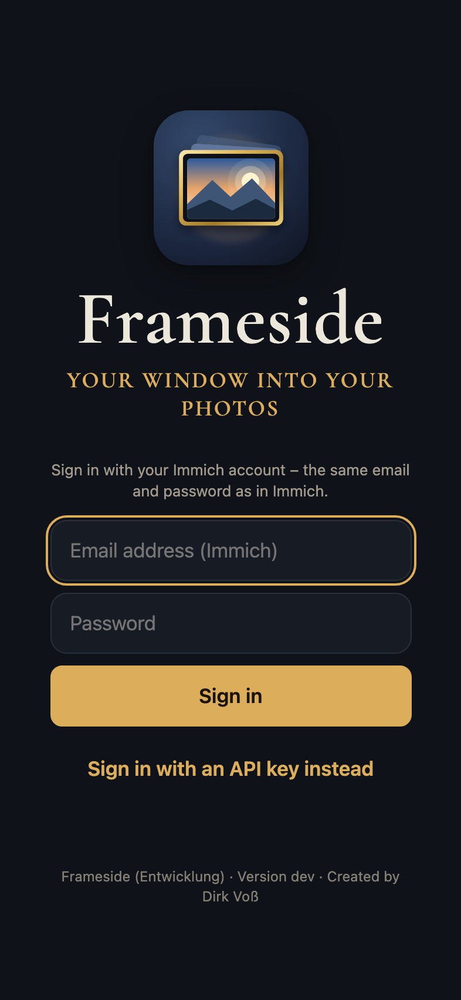
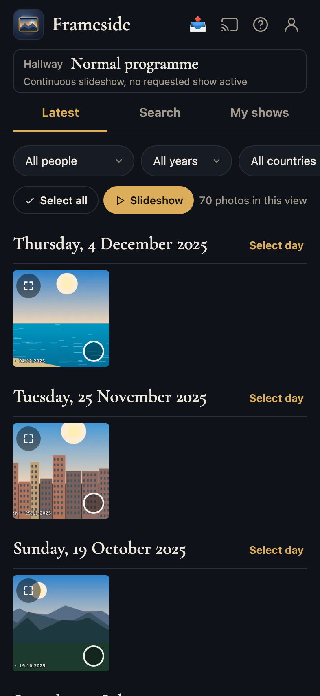
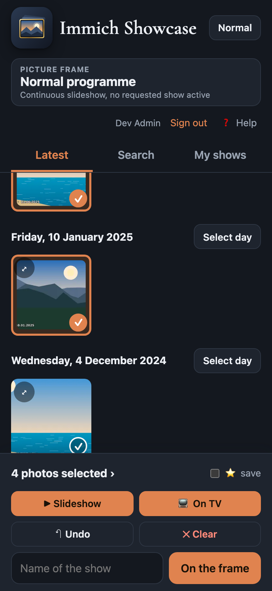
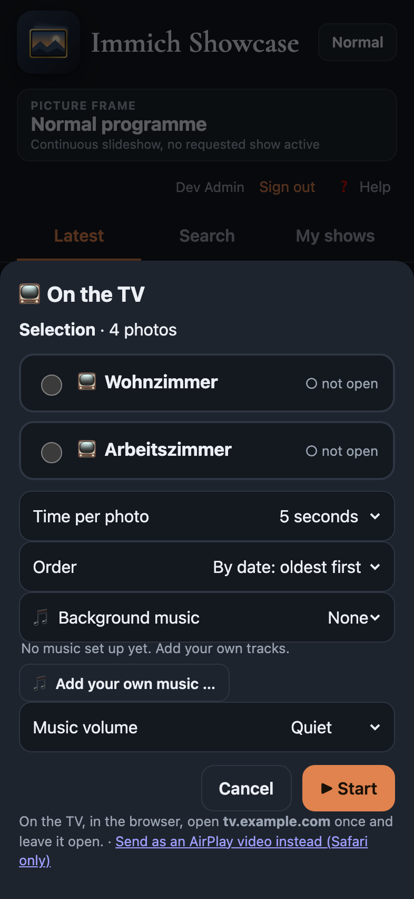
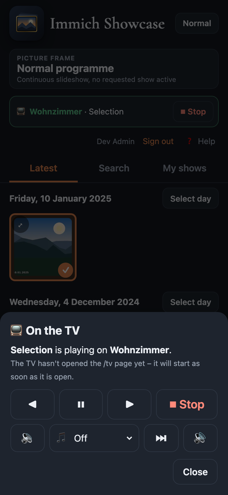
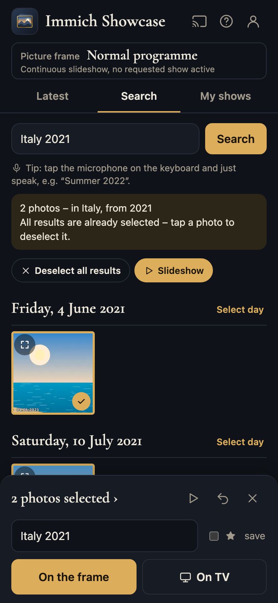
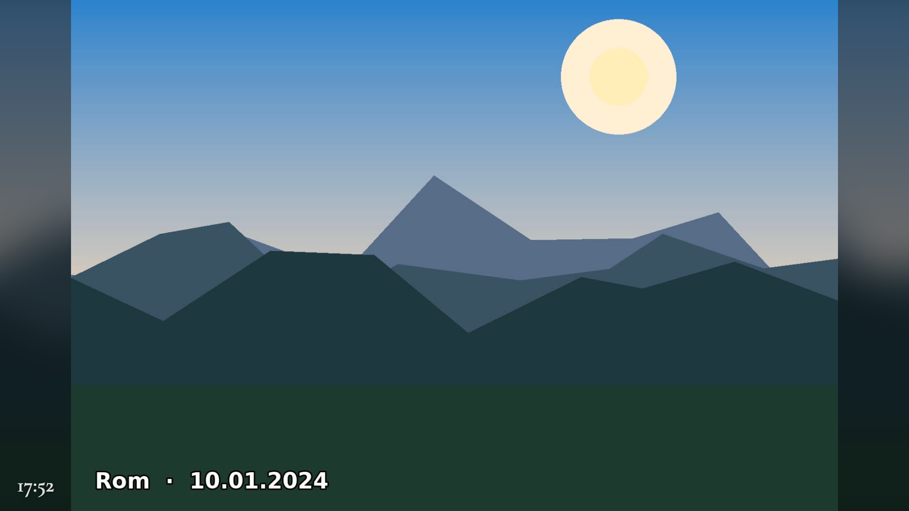
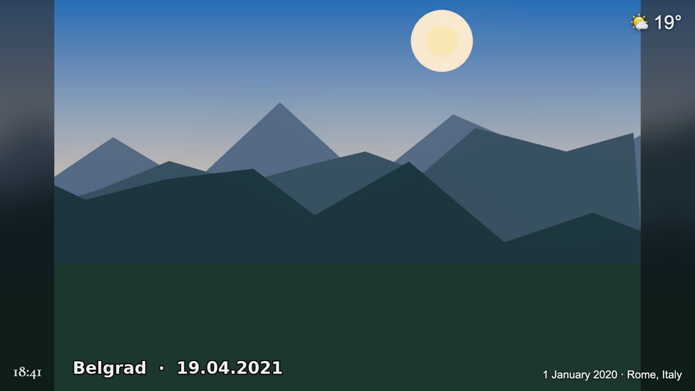
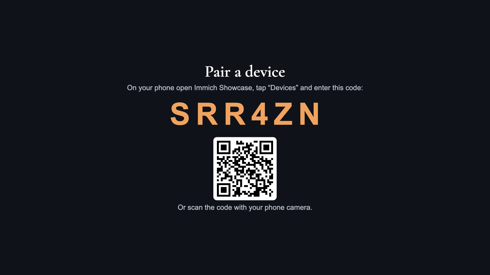
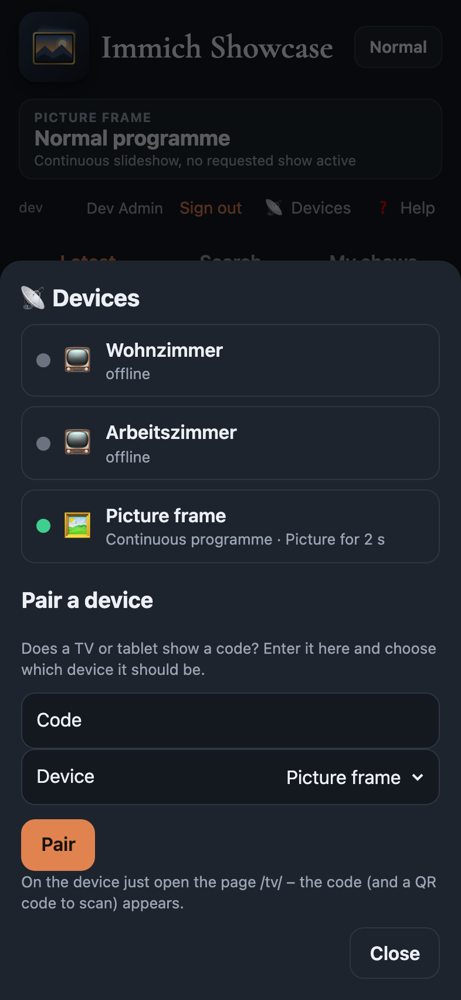

# Immich Showcase

<p align="center"></p>

**Show your [Immich](https://immich.app) photos on the TV and on a picture frame – and let the whole family do it from their phone.**
Search in plain sentences ("Grandma and Anna, Christmas 2019, on the beach"), tap the photos you like, give the show a name and send it to the living-room TV or the picture frame in the hallway. Optional background music, videos, and a continuous slideshow when nobody has asked for anything.

🇩🇪 [Deutsche Anleitung](README.de.md)

> Immich Showcase is an independent community project. It is not affiliated with, endorsed by, or part of the Immich project. "Immich" is the name of the software it works with.

| Sign in | Latest photos | Selection | Send to TV |
|---|---|---|---|
|  |  |  |  |

| Remote control | Search in sentences |
|---|---|
|  |  |

The picture frame (continuous programme with blurred background, date, place and clock):



With weather and appointments at the top right, device pairing by code/QR on the TV, and the Devices view in the app:

| Frame with weather and appointments | Pair a device (TV/tablet) | Devices view |
|---|---|---|
|  |  |  |

*(All screenshots use invented sample photos.)*

## What it does
- **Search in whole sentences** in five languages: people, time, place, motif.
- **Linked filters** (person, year, country, photos/videos), "select the whole day", undo.
- **Shows:** save, name and restart them later.
- **TV:** a web page you open once in the TV browser (LG webOS, Android TV, Shield, Chromecast with browser …). Control it from the phone: pause, next/previous, music, stop. Videos are converted in advance so the TV can play them.
- **Picture frame:** an own player for any tablet (browser or [Fully Kiosk](https://www.fully-kiosk.com)). Without a request it shows a continuous programme with a clock; a show from the app interrupts it, "Stop" brings the programme back.
- **Background music** from your own folders (none is included).
- **Safe by design:** the app can never delete a photo, runs as non-root in a read-only container, and every person can use their own Immich account.

## What you need
- A running **Immich** (tested with 3.2.x) and a user account on it.
- A machine with **Docker + Docker Compose** (NAS, mini PC, Raspberry Pi – images for amd64 and arm64).
- For the picture frame: a **tablet** (or any device with a browser). For the TV: a TV with a web browser.

## Installation (about 5 minutes)
Shortcut: `./install.sh` (or `./install.sh --with-immich` if you have no Immich yet) does the steps below for you.

```bash
git clone https://github.com/dirkvoss/immich-showcase.git
cd immich-showcase
cp .env.example .env
docker compose up -d
docker compose logs showcase       # shows a one-time setup code
```

Open `http://<server>:8090` in a browser. The **setup wizard** guides you:

1. enter the **setup code** from the log (so nobody else on your network can take over the setup),
2. enter the **address of your Immich** (for example `http://192.168.1.10:2283`),
3. sign in with your **Immich account** (email + password). Immich Showcase creates its own API key *without delete permissions* – your password is not stored,
4. choose a **PIN**.

The app restarts by itself. On an iPhone: Share → "Add to Home Screen".

**Immich runs in Docker on the same machine?** Either use the machine's IP address as above, or join Immich's Docker network: put `COMPOSE_FILE=docker-compose.yml:docker-compose.immich-network.yml` and `SHOWCASE_IMMICH_NETWORK=immich_default` (see `docker network ls`) in `.env`, and use `http://immich_server:2283` as the address.

**Prefer no wizard?** Put `RAHMEN_IMMICH_URL` and `RAHMEN_IMMICH_KEY` into `.env`. Values in `.env` always win over the wizard.

## Set up a TV
1. In `.env`: `RAHMEN_WEB_TV_ZIELE=livingroom=Living room` (`id=Display name`, comma-separated for several TVs).
2. `docker compose up -d`
3. On the TV, open the browser at `http://<server>:8090/tv/?ziel=livingroom` and bookmark it. Leave the page open – it shows "ready" and waits.
4. On your phone: select photos → **On TV** → choose the TV, time per photo, order, music → **Start**.

## Set up a picture frame
1. In `.env`: `RAHMEN_WEB_RAHMEN_ZIELE=frame=Picture frame`
2. Choose what the frame shows when nobody asks for anything (`RAHMEN_WEB_RAHMEN_*`, all optional):
   - **Albums:** `RAHMEN_WEB_RAHMEN_ALBEN=<album-id>,<album-id>` (ids from the Immich album URL)
   - **Marker albums:** `RAHMEN_WEB_RAHMEN_MARKER=1` – any album whose **description contains a tag with `frame`** (e.g. `#frame`, `#picture-frame`; German: `#rahmen`) joins the programme automatically. A tag like `#onlyframe` (German: `#nurrahmen`) shows **only** that album, in the order chosen in the app. Remove the tag to go back to normal.
   - **Weighted sources:** `RAHMEN_WEB_RAHMEN_QUELLEN=<album-id>:70, neu14:20, *:10` (an album, "uploaded in the last 14 days", the whole library – with weights)
   - Seconds per photo `RAHMEN_WEB_RAHMEN_SEK`, background `RAHMEN_WEB_RAHMEN_FUELLUNG` (`unscharf` = blurred, `zuschnitt` = crop, `balken` = black bars), caption `RAHMEN_WEB_RAHMEN_ANZEIGE=datum,ort`, night rest `RAHMEN_WEB_RAHMEN_NACHT=22:00-06:30`
3. `docker compose up -d`
4. On the tablet, open `http://<server>:8090/tv/?ziel=frame` in full screen – or set it as the start page of Fully Kiosk.
   *Tip (Fully Kiosk):* if you use it as the **screensaver**, enter the address as the screensaver playlist item and restart the app once – Fully Kiosk only reads changes to the playlist after a restart.

## Pair devices by code (no typing of addresses)
1. On the TV or tablet, open **`http://<server>:8090/tv/`** (no `?ziel=`). It shows a 6-character **code** and a **QR code**.
2. In the app tap **📡 Devices**, enter the code (or scan the QR code with your phone camera – the code is filled in), choose which TV/frame this is, tap **Pair**.
3. The device remembers its role. From then on `/tv/` alone is enough. (The TVs and frames themselves are still defined in `.env`, see below.)

## The Devices view
**📡 Devices** in the app lists every TV and frame: online or offline, what is playing, how long the current picture has been shown, and when it was last seen.

## Several frames, schedules, "on this day"
- **Own programme per frame:** `RAHMEN_WEB_RAHMEN_QUELLEN_FLUR=<album-id>:70, neu14:30` (the id in capitals) – see `.env.example`.
- **Schedule:** `RAHMEN_WEB_RAHMEN_ZEITPLAN=Mo-Fr 18:00-22:00 = <album-id>:1; Sa,So 08:00-20:00 = heute:50, *:50` – different sources at different times (also per frame, ranges across midnight allowed).
- **On this day:** the source `heute` (or `heute5` = ±5 days) shows photos taken on this day in earlier years.
- **Weather and appointments** at the top right of the frame: `RAHMEN_WEB_WETTER_ORT=52.52,13.40` (open-meteo.com, free, no account – your **server** asks, only the coordinates are sent) and `RAHMEN_WEB_KALENDER_URL=<iCalendar link>` (Google/Nextcloud/Apple "secret iCal address"; simple daily/weekly/yearly repeats are understood). Only what you configure appears.

## Frame programme by person
Add `person=<name>` to the sources: `RAHMEN_WEB_RAHMEN_QUELLEN=person=Anna Muster:60, person=grandma:20, *:20` shows photos of that person (name as in Immich, or a nickname from `RAHMEN_WEB_ALIASE`; `Anna+Ben` = both together). An unknown name is skipped, the other sources continue.

## Switch the tablet screen off at night (Fully Kiosk)
With `RAHMEN_WEB_RAHMEN_NACHT=22:00-06:30` the frame goes black. Fully Kiosk can really switch the **screen off** (saves power, protects the display): in Fully enable *Remote Administration* and set a password, then set `RAHMEN_WEB_FULLY_RAHMEN=<tablet address>` and `RAHMEN_WEB_FULLY_PASSWORT=…`. The screen is switched only at the **change** (so a manual wake-up is not overruled). In **📡 Devices** you can switch it by hand, see the **battery level**, and you get a Pushover alert when the tablet is almost empty and not charging.

## Home Assistant
Ready-made sensors, buttons and examples are in [`examples/home-assistant/immich_showcase.yaml`](examples/home-assistant/immich_showcase.yaml): state of every TV/frame (offline / ready / playing / continuous), an online sensor, and commands (pause, next, stop, start a saved show, screen on/off) as `rest_command`s. Home Assistant's address must be in `RAHMEN_WEB_LAN`. API: `GET /api/ha/status`, `POST /api/ha/steuer|show|bildschirm` (header `X-Rahmen: 1`).

## Quick install helper
`./install.sh` starts Immich Showcase and prints the address and setup code. **No Immich yet?** `./install.sh --with-immich` starts **Immich and Immich Showcase together** (see `examples/immich-stack/`).

## Daily use
1. Open the app on your phone and sign in (PIN, or your Immich account if you set `RAHMEN_WEB_AUTH=immich`).
2. **Latest** shows recent photos with filters; **Search** understands sentences; **My shows** keeps saved shows.
3. Tap photos to select them. **Slideshow** plays in the phone's browser, **On TV** and **On the frame** send them to a device.
4. The phone is a remote control while a show runs. **Stop** brings the continuous programme back on the frame.

## Sign-in options
`RAHMEN_WEB_AUTH=pin` (default: one shared 6-digit PIN), `immich` (each person signs in with their Immich account and sees **only their own** photos and shows) or `beide` (both). Without `RAHMEN_WEB_LAN` and `RAHMEN_WEB_PROXIES` every request needs the PIN/account – that is the safe default. Change the PIN later:
`docker compose exec showcase python /app/rahmen_web.py --set-pin 123456`

## Use it from outside your home
Always behind a **reverse proxy with HTTPS** (Nginx Proxy Manager, Caddy, Traefik …). Set `SHOWCASE_BIND=127.0.0.1` if the proxy runs on the same machine and add the proxy's IP to `RAHMEN_WEB_PROXIES`. WebSocket support is not needed. Only list networks in `RAHMEN_WEB_LAN` if internet traffic can never arrive with an internal address.

## Your own music
None is included (licences). Two ways:
- **Folder:** put mp3/ogg/m4a files into sub-folders of `/data/musik` (each folder = one collection), e.g. mount `./musik:/data/musik:ro`. Title/artist come from the file tags or the file name. An optional `info.json` can describe titles (`name`, `stuecke` with `datei`, `titel`, `urheber`, `lizenz`).
- **In the app:** set `RAHMEN_WEB_MUSIK_UPLOAD=1`; then "Add your own music …" appears in the "On TV" window.

## Update
`docker compose pull && docker compose up -d` – or `deploy/deploy.sh <version>` (backup, health checks, automatic rollback; see [RELEASING.md](RELEASING.md)).

## Troubleshooting
| Symptom | What to do |
|---|---|
| "Setup required" in the app | Not connected to Immich yet – open `/setup/` |
| HTTP 401 in the app | PIN or account missing / expired |
| TV shows "not open" in the app | Open the TV address in the TV browser and leave it open |
| Frame stays on the old picture / screensaver address ignored | Fully Kiosk: restart the app after changing the playlist |
| Containers can't reach Immich | Use the machine's IP instead of `localhost`, or join Immich's Docker network (see above) |
| Anything else | `docker compose logs showcase`; the **Help** window in the app can create a *support package* (diagnostics without secrets) for a bug report |

## Report a problem or suggest something
- In the app: **Help → 🐞 Report a problem** (opens GitHub with your version filled in) – please attach the **support package** from the same window (diagnostics without passwords, PIN or keys).
- Wishes and ideas: **Help → 💡 Wish or idea**, or the [issue tracker](https://github.com/dirkvoss/immich-showcase/issues).
- Questions and setup help: [Discussions](https://github.com/dirkvoss/immich-showcase/discussions) – German and English are both fine.

## Settings
Everything installation-specific lives in `.env` – every setting is explained in [.env.example](.env.example). Your own `.env` is never part of the repository.

## Languages
The interface and the sentence search work in **German, English, Spanish, French and Dutch** (automatic by browser language, or `?lang=xx`; switcher in the Help window). The Spanish, French and Dutch translations are machine-made – corrections are very welcome (`static/i18n/<language>.json`).

## Security
- The app can **never delete photos**; its API key has no delete rights.
- Sign-in with PIN or Immich account, locked after failed attempts (per IP and per email). Every person gets an own, revocable key. Sessions last 90 days; writing requests need an own header.
- The container runs as non-root with a read-only file system, no Linux capabilities and a memory limit.
- The TV/frame pages show photos **without sign-in** to devices in a trusted network (`RAHMEN_WEB_LAN`) – keep that network small.
- Found a vulnerability? See [SECURITY.md](SECURITY.md).

## Limitations
- Without database access, the motif search ("on the beach") takes the best 60 ranked hits instead of checking similarity exactly. Filters are slightly slower but equivalent. Database access is optional (`RAHMEN_DB_DSN`).
- No music is bundled.

## Development
`pip install -r requirements-dev.txt && python -m pytest`. Releases are built by GitHub Actions from version tags; see [RELEASING.md](RELEASING.md) and [CONTRIBUTING.md](CONTRIBUTING.md).

## Third-party parts
Font *Cormorant Garamond* (SIL OFL 1.1). QR code generator *qrcode-generator* by Kazuhiko Arase (MIT, `static/qrcode.js`). The logo is original. No music in the repository.

## License
[GNU Affero General Public License v3.0 or later](LICENSE) (AGPL-3.0-or-later), like Immich itself. If you run a modified version as a service for others, you must make your changes available. Font: see `static/fonts/OFL.txt`.
