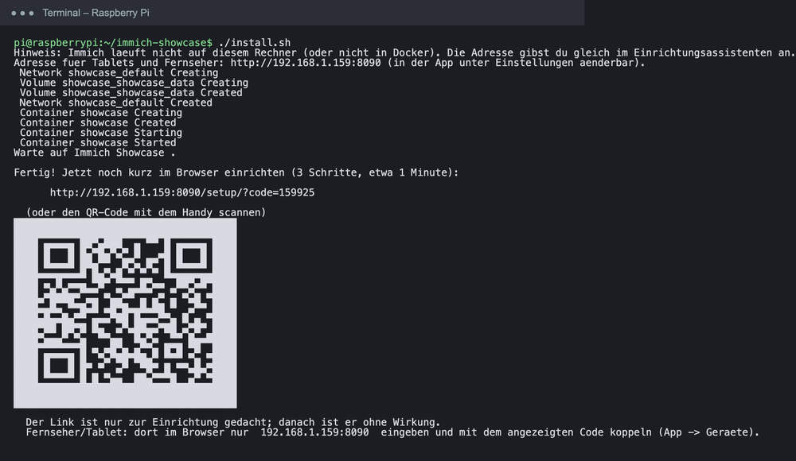
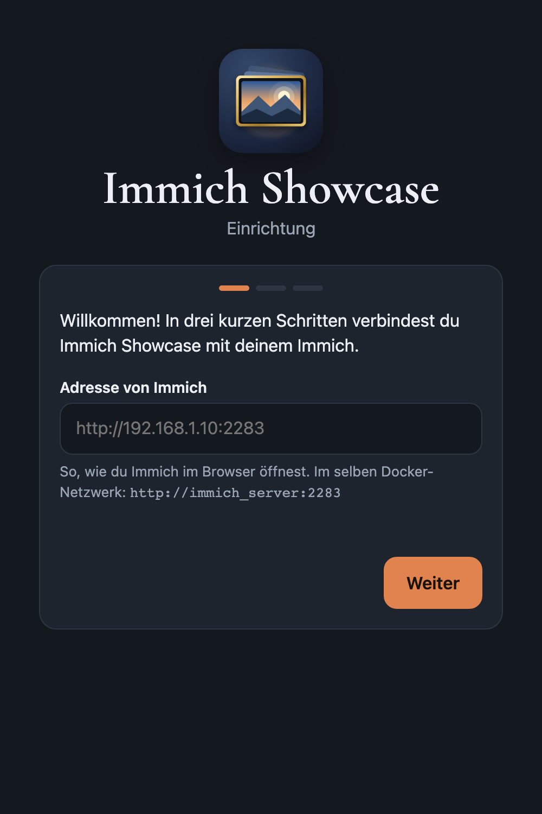
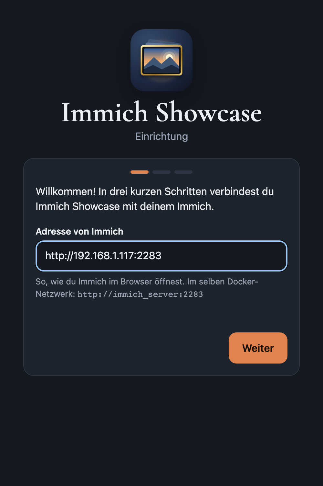
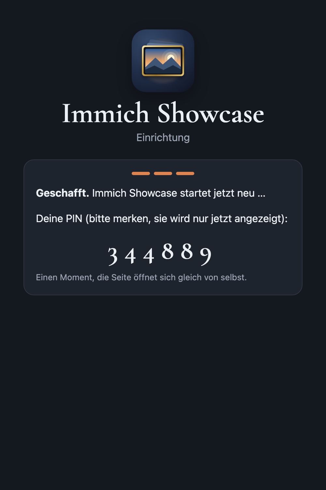
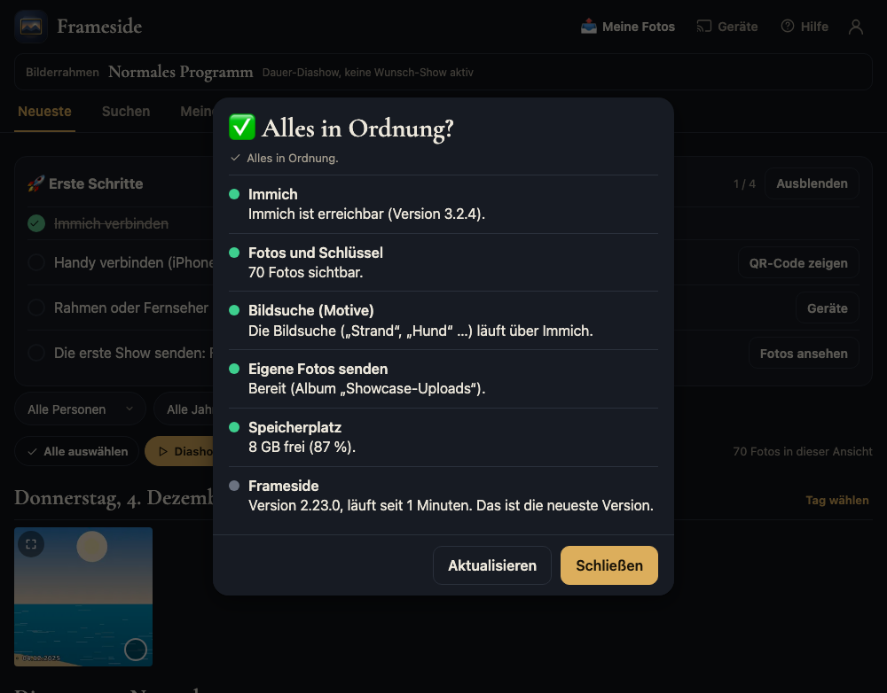

# Frameside auf einem anderen Rechner als Immich (z. B. Raspberry Pi)

Immich muss nicht auf demselben Rechner laufen wie Frameside. Typisch ist: **Immich** läuft auf einem NAS oder Server, **Frameside** auf einem kleinen, sparsamen Rechner, zum Beispiel einem **Raspberry Pi**, der dauerhaft im Heimnetz hängt (und optional gleich als Bilderrahmen am Fernseher dient).

Diese Anleitung zeigt den Weg Schritt für Schritt mit Bildern. Die Grundlagen (Rahmen koppeln, erste Show senden, iPhone-App) stehen in der [Anleitung „Erste Schritte“](anleitung.md). Hier geht es um das, was bei **zwei getrennten Rechnern** anders ist.

```
   Handy / Tablet / Fernseher            Raspberry Pi                    NAS / Server
   ┌──────────────────────┐   WLAN   ┌───────────────────┐  Heimnetz  ┌───────────────┐
   │  Browser oder App    │ ───────▶ │ Frameside   │ ─────────▶ │    Immich     │
   └──────────────────────┘          │ (Port 8090)       │            │ (Port 2283)   │
                                     └───────────────────┘            └───────────────┘
```

**Du brauchst:**

- einen Rechner für Frameside mit **Docker** (Raspberry Pi 4 oder 5 mit 64-Bit-Raspberry-Pi-OS empfohlen, die Images gibt es auch für arm64),
- ein laufendes **Immich**, das vom Pi aus über das Netz erreichbar ist,
- ein Immich-Konto (E-Mail und Passwort).

> **Ehrlicher Hinweis:** Diesen Ablauf habe ich auf zwei getrennten Rechnern im Heimnetz getestet (Debian mit Docker, Immich auf dem einen, Frameside auf dem anderen). Auf echter Raspberry-Pi-Hardware habe ich ihn noch nicht ausprobiert. Rückmeldungen sind willkommen.

---

## 1. Vorbereitung auf dem Raspberry Pi

1. **Raspberry Pi OS (64-Bit)** mit dem Raspberry Pi Imager aufspielen, dort WLAN/LAN und SSH einrichten. Eine **SSD** ist robuster als eine SD-Karte, aber nicht Pflicht: Frameside speichert keine Fotos, nur seine Einstellungen.
2. Per SSH anmelden und **Docker** installieren (zwei Befehle, danach einmal ab- und wieder anmelden):

```bash
curl -fsSL https://get.docker.com | sh
sudo usermod -aG docker $USER
```

3. Prüfe, ob der Pi **Immich erreicht**. Im Browser eines Rechners im selben Netz öffnest du Immich so, wie du es immer tust, z. B. `http://192.168.1.20:2283`. Genau diese Adresse brauchst du gleich im Assistenten. Tipp: Gib dem Immich-Rechner eine feste IP-Adresse, damit sich die Adresse nicht ändert.

> **Abkürzung für den Raspberry Pi:** Statt der Schritte 1 und 2 genügt auf einem frisch aufgespielten Pi (Raspberry Pi OS Lite, 64-Bit) ein einziger Befehl, der Docker und Frameside installiert und den Server im Netz anmeldet:
> `curl -fsSL https://raw.githubusercontent.com/dirkvoss/frameside/main/examples/raspberry-pi/install-pi.sh | bash -s -- --hostname showcase`

## 2. Installieren (1 Befehl)

Auf dem Pi:

```bash
curl -fsSL https://raw.githubusercontent.com/dirkvoss/frameside/main/install.sh | bash
```

Das Skript meldet, dass es **auf diesem Rechner kein Immich gefunden** hat. Das ist hier richtig und kein Fehler: Die Adresse gibst du gleich im Assistenten an. Am Ende steht der **Einrichtungs-Link** mit QR-Code.



<details markdown="1">
<summary>Optionen für diesen Fall</summary>

- `--bonjour`: Der Pi meldet sich im Netz an, die iPhone-App findet ihn dann selbst („Gefunden im WLAN“). Das funktioniert nur mit Docker unter Linux.
- `--port 80`: Showcase läuft auf Port 80, dann genügt am Fernseher die reine IP-Adresse.
- Weitere Geräte im Heimnetz greifen auf den Pi zu, nicht auf Immich. Der Pi braucht deshalb eine **feste IP-Adresse** (im Router eintragen).
</details>

## 3. Einrichtungsassistent

Öffne den Link aus dem Terminal im Browser (am Handy kannst du den QR-Code scannen).

### Schritt 1 – Adresse von Immich eintragen

Weil Immich nicht auf diesem Rechner läuft, fragt der Assistent nach der Adresse. Trage ein, **wie du Immich im Browser öffnest**:



Zum Beispiel `http://192.168.1.20:2283`:



| Wo läuft Immich? | Adresse |
|---|---|
| Anderer Rechner im Heimnetz | `http://<IP-Adresse>:2283` |
| Anderer Rechner, mit Namen | `http://<Rechnername>:2283` (der Name muss auch auf dem Pi auflösbar sein) |
| Hinter eigener Domain mit HTTPS | `https://immich.example.com` (nicht getestet) |

Ein **Fehler beim „Weiter“** heißt fast immer: Der Pi erreicht Immich nicht. Prüfe Adresse, Port 2283 und eine eventuelle Firewall auf dem Immich-Rechner. Auf dem Pi hilft zum Testen: `curl http://<IP>:2283/api/server/version`.

### Schritt 2 – Immich-Konto

Melde dich einmal mit deinem Immich-Konto an. Frameside legt dafür **einen eigenen Schlüssel ohne Lösch-Rechte** an. Das Passwort wird nicht gespeichert.


### Schritt 3 – Wer darf zugreifen?

Wie in der [Hauptanleitung](anleitung.md): **gemeinsame PIN** (empfohlen) oder **Immich-Konten**. Der Haken „Im Heimnetz ohne PIN öffnen“ gilt für das Netz, in dem der Pi hängt.

### Fertig

Der Assistent zeigt deine PIN, den QR-Code für die iPhone-App und die **Adresse des Pi** für Tablets und Fernseher. Alle Geräte benutzen **diese** Adresse (die des Pi), nicht die von Immich.



## 4. Prüfen: Fotos und „Alles in Ordnung?“

Die Fotos erscheinen jetzt, obwohl sie auf dem anderen Rechner liegen. Rahmen koppeln, Show senden und iPhone-App funktionieren wie in der [Hauptanleitung](anleitung.md).


Unter dem Konto-Symbol → **„Alles in Ordnung?“** siehst du, ob die Verbindung zu Immich steht:



---

## Was bei getrennten Rechnern anders ist

| Thema | Auswirkung |
|---|---|
| **Netzwerk** | Fotos laufen von Immich über den Pi zum Rahmen. Ein stabiles LAN ist besser als WLAN, besonders bei großen Alben. |
| **Motivsuche** („am Strand“) | Funktioniert über Immich selbst und liefert die besten 60 Treffer. Die exakte Prüfung mit direktem Datenbankzugang (`RAHMEN_DB_DSN`) ist optional und bei getrennten Rechnern aufwendiger. Suchen nach Person, Zeit und Ort funktioniert vollständig. |
| **Eigene Fotos hochladen** | Geht wie gewohnt, die Fotos landen im Album „Showcase-Uploads“ in Immich. |
| **Ausfall** | Ist der Pi aus, zeigen die Rahmen nichts Neues. Ist der Immich-Rechner aus, meldet „Alles in Ordnung?“ den Fehler mit einem Hinweis. |
| **Updates** | Der Pi und Immich werden getrennt aktualisiert. Für Frameside: `docker compose pull && docker compose up -d` im Ordner `~/immich-showcase`. |

## Der Pi als Bilderrahmen am Fernseher (optional)

Derselbe Pi kann zusätzlich einen angeschlossenen Monitor oder Fernseher als Bilderrahmen betreiben. Dafür gibt es ein fertiges Skript (Chromium im Kiosk-Modus, startet beim Einschalten):

```bash
./examples/raspberry-pi/setup-kiosk.sh http://localhost:8090/tv/
```

Mehr dazu im Abschnitt „Raspberry Pi in 5 Minuten“ der [README](../README.de.md).

## Wenn etwas nicht klappt

| Problem | Lösung |
|---|---|
| Assistent: „Immich nicht erreichbar“ | Adresse stimmt? Port 2283 offen? Test auf dem Pi: `curl http://<IP>:2283/api/server/version`. |
| Anmeldung schlägt fehl | E-Mail und Passwort des **Immich-Kontos** (nicht der PIN). Bei „Immich-Konten“-Modus braucht jede Person ein eigenes Konto. |
| Fotos erscheinen, aber der Rahmen bleibt schwarz | Rahmen koppeln (Abschnitt 4 der [Hauptanleitung](anleitung.md)). Adresse am Gerät muss die **des Pi** sein. |
| iPhone-App findet den Server nicht | Mit `--bonjour` installieren oder die Adresse des Pi von Hand eintragen. |
| Irgendetwas anderes | **„Alles in Ordnung?“** zeigt die Ursache in Klartext. |
