# Erste Schritte mit Frameside – Schritt für Schritt

Diese Anleitung führt dich in etwa **10 Minuten** von „nichts“ bis zum ersten Foto auf dem Bilderrahmen. Alle Bilder stammen aus einer echten Installation auf einem frischen Rechner.

**Du brauchst:**

- einen Rechner oder NAS im Heimnetz, auf dem **Docker** läuft (Linux, Mac, Synology, Unraid, TrueNAS …),
- ein laufendes **Immich** (auf demselben Rechner oder woanders im Heimnetz),
- ein Tablet, einen Fernseher oder einen alten Bildschirm mit Browser als **Bilderrahmen**,
- optional ein iPhone für die App.

> Frameside **ersetzt Immich nicht**. Es zeigt deine Immich-Fotos auf Rahmen und Fernsehern und lässt die ganze Familie vom Handy aus bestimmen, was dort läuft. Deine Fotos bleiben in Immich.

---

## 1. Installieren (1 Befehl)

Öffne ein Terminal auf dem Server und gib ein:

```bash
curl -fsSL https://raw.githubusercontent.com/dirkvoss/frameside/main/install.sh | bash
```

Das Skript erkennt ein auf demselben Rechner laufendes Immich selbst, verbindet sich mit dessen Docker-Netz und startet Frameside. Eine Datei bearbeiten musst du nicht.

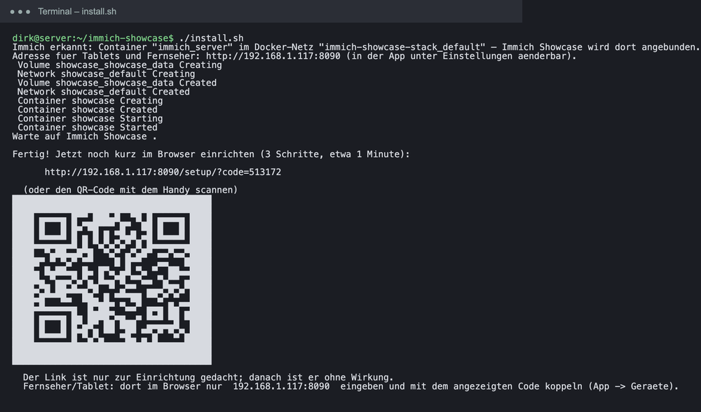

Am Ende steht ein **Einrichtungs-Link** (und ein QR-Code). Öffne ihn im Browser. Er ist nur für die Einrichtung gedacht und danach ohne Wirkung.

<details markdown="1">
<summary>Immich läuft noch nicht? Oder du willst einen anderen Port?</summary>

- Immich gleich mitinstallieren: `./install.sh --with-immich`
- Anderen Port nutzen (z. B. 80, dann genügt am Fernseher die reine IP-Adresse): `./install.sh --port 80`
- Server im Netz per Bonjour ankündigen (die iPhone-App findet ihn dann selbst): `./install.sh --bonjour`
- NAS mit Oberfläche statt Terminal (Unraid, Synology, TrueNAS, Portainer): Vorlagen im Ordner [`examples/`](../examples).
</details>

## 2. Einrichtungsassistent (3 Schritte, etwa 1 Minute)

### Schritt 1 – Immich

Der Assistent hat Immich bereits gefunden. Die grüne Meldung zeigt Adresse und Version. Läuft Immich woanders, trägst du die Adresse hier ein.

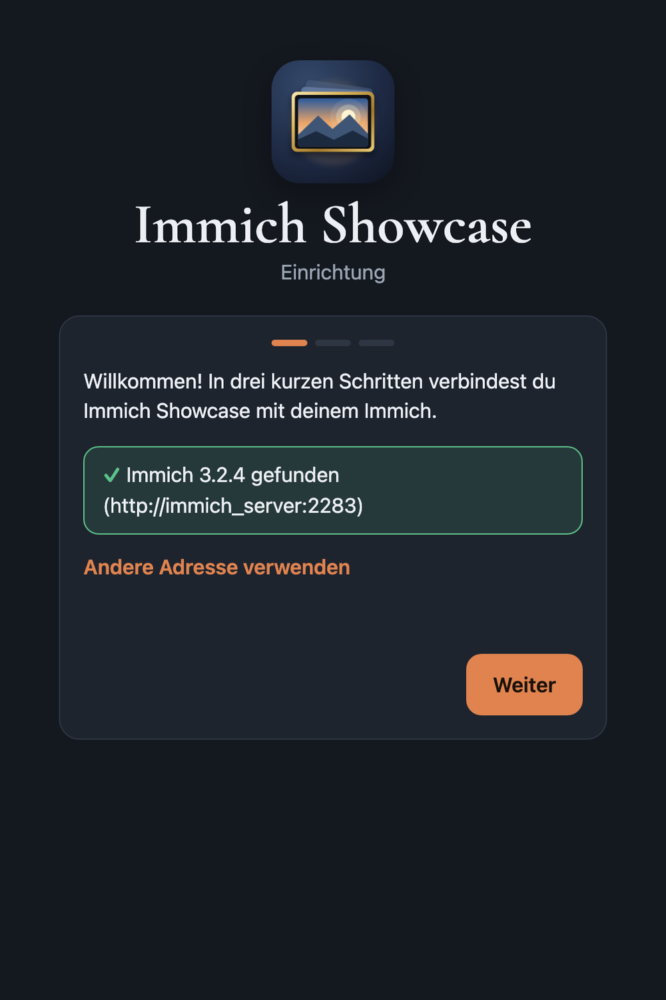

### Schritt 2 – Immich-Konto

Melde dich einmal mit deinem Immich-Konto an. Frameside legt damit **einen eigenen Schlüssel ohne Lösch-Rechte** an. Das Passwort wird **nicht gespeichert**.

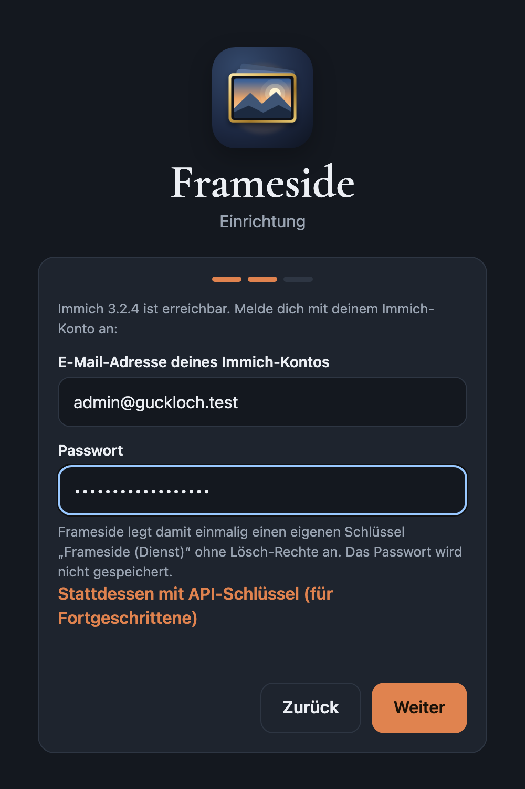

### Schritt 3 – Wer darf zugreifen?

| Auswahl | Wann sinnvoll |
|---|---|
| **Gemeinsame PIN** (empfohlen) | Die Familie teilt sich eine 6-stellige PIN und sieht dieselben Fotos. Mit dem Haken „Im Heimnetz ohne PIN öffnen“ entfällt die PIN zu Hause. |
| **Immich-Konten** | Jede Person meldet sich mit ihrem eigenen Immich-Konto an und sieht nur ihre eigenen Fotos. |

Unsicher? Nimm die PIN, du kannst es später unter *Einstellungen* ändern.

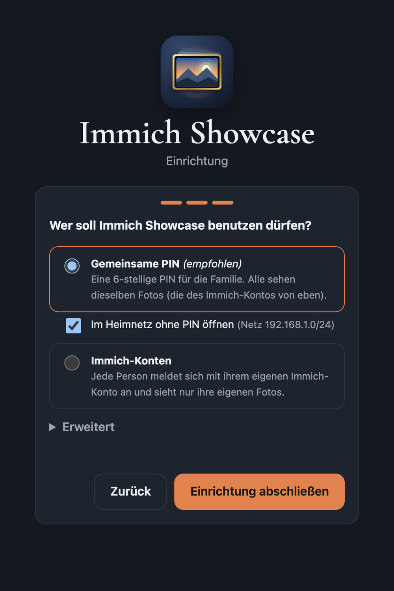

### Fertig

Der letzte Bildschirm zeigt dir **deine PIN**, den **QR-Code für die iPhone-App** und die **Adresse für Tablets und Fernseher**. Notiere die PIN.

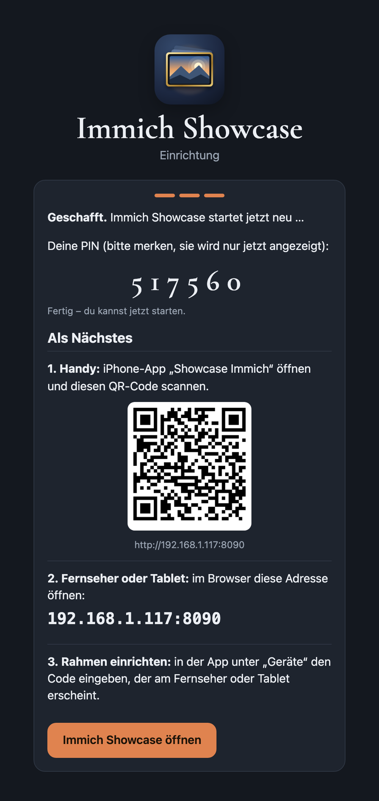

## 3. Die Oberfläche und „Erste Schritte“

Beim ersten Öffnen führt ein kurzer Rundgang durch die Oberfläche. Danach hilft die Karte **„Erste Schritte“** oben auf der Seite. Sie hakt ab, was schon erledigt ist (Immich verbinden, Handy verbinden, Rahmen koppeln, erste Show senden).

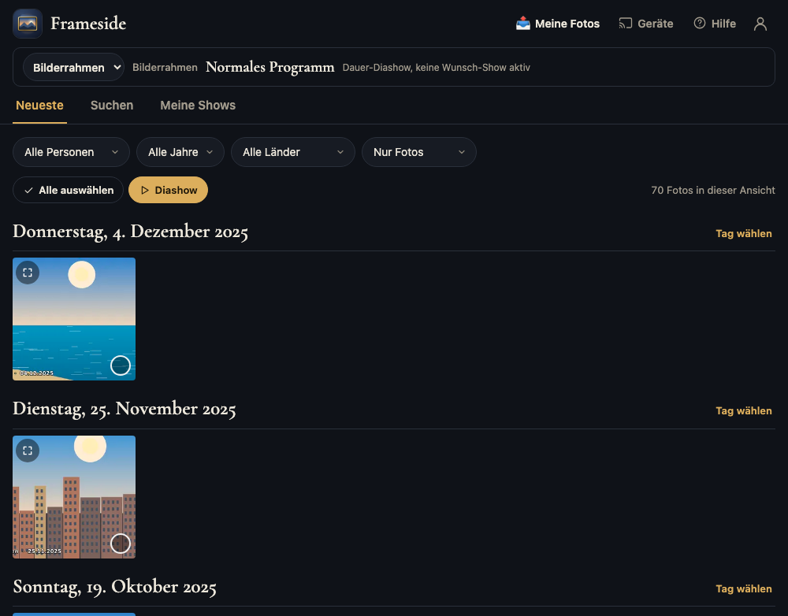

## 4. Einen Bilderrahmen oder Fernseher koppeln

1. Tippe oben auf **Geräte** → **＋ Gerät hinzufügen**. Die App zeigt dir die Adresse des Servers (z. B. `192.168.1.20:8090`).

    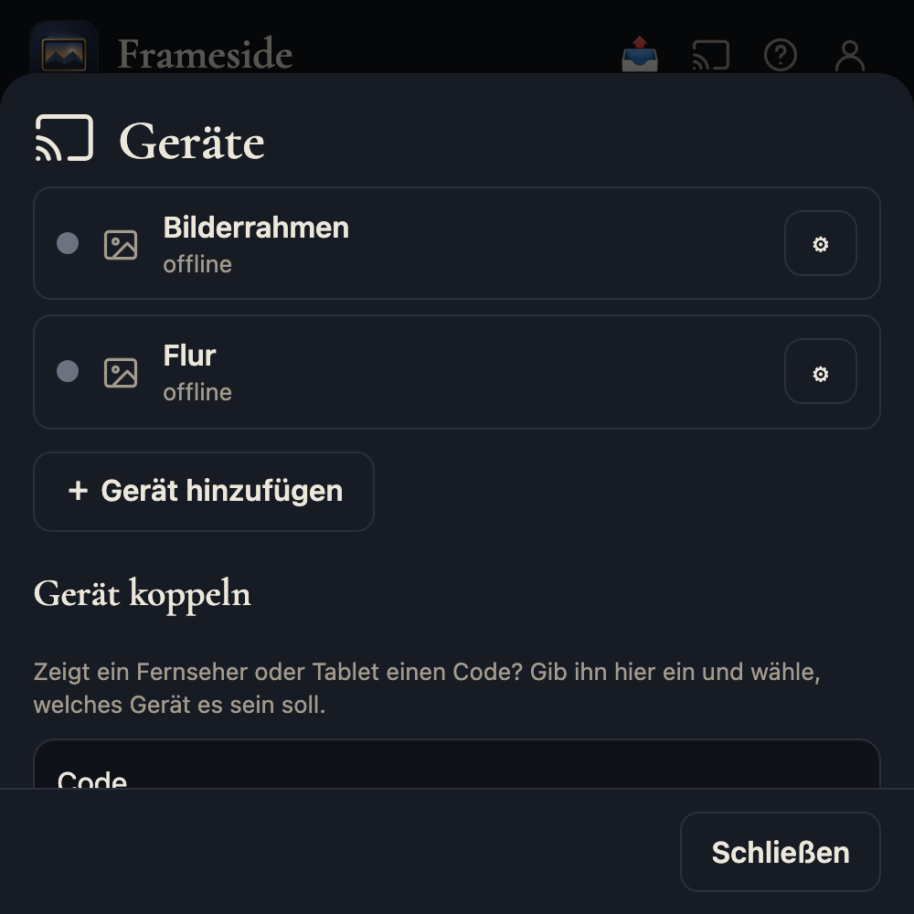

2. Öffne am Tablet oder Fernseher im Browser genau diese **Adresse**. Das Gerät zeigt kurz einen Code, den du **nicht eintippen musst**.

    

3. In der App erscheint das Gerät **von selbst**, zum Beispiel „LG-Fernseher gefunden“. Gib einen Namen ein (z. B. „Wohnzimmer“) und tippe auf **Verbinden**. Die Art (Fernseher oder Bilderrahmen) erkennt Frameside am Gerät. Du kannst sie ändern.

    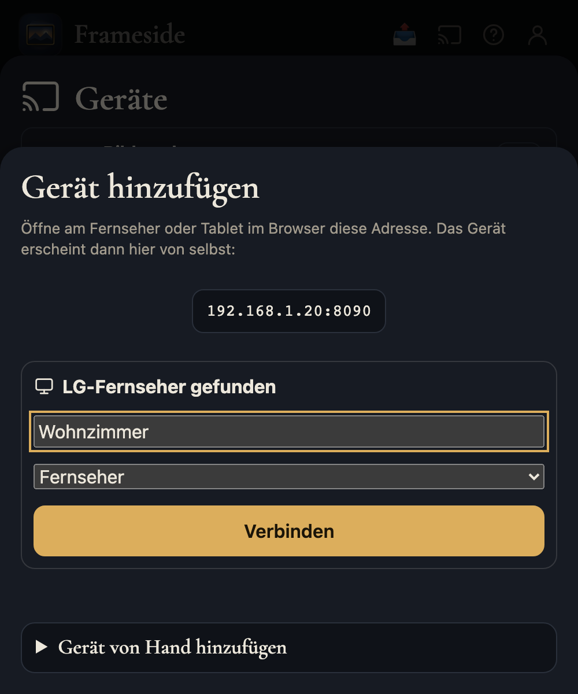

Zeigt die App das Gerät nicht, gib den Code vom Bildschirm unter **Geräte → Gerät koppeln** ein oder scanne den QR-Code (in der iPhone-App mit „QR-Code am Gerät scannen“).

Das Gerät merkt sich die Kopplung und startet danach von selbst mit der Diashow. Tipp: Auf dem Tablet „Zum Home-Bildschirm hinzufügen“ bzw. Vollbild nutzen.

## 5. Die erste Show senden

Tippe Fotos an (oder „Tag wählen“) und dann unten auf **Auf den Rahmen**. Wenige Sekunden später zeigt der Rahmen deine Auswahl.

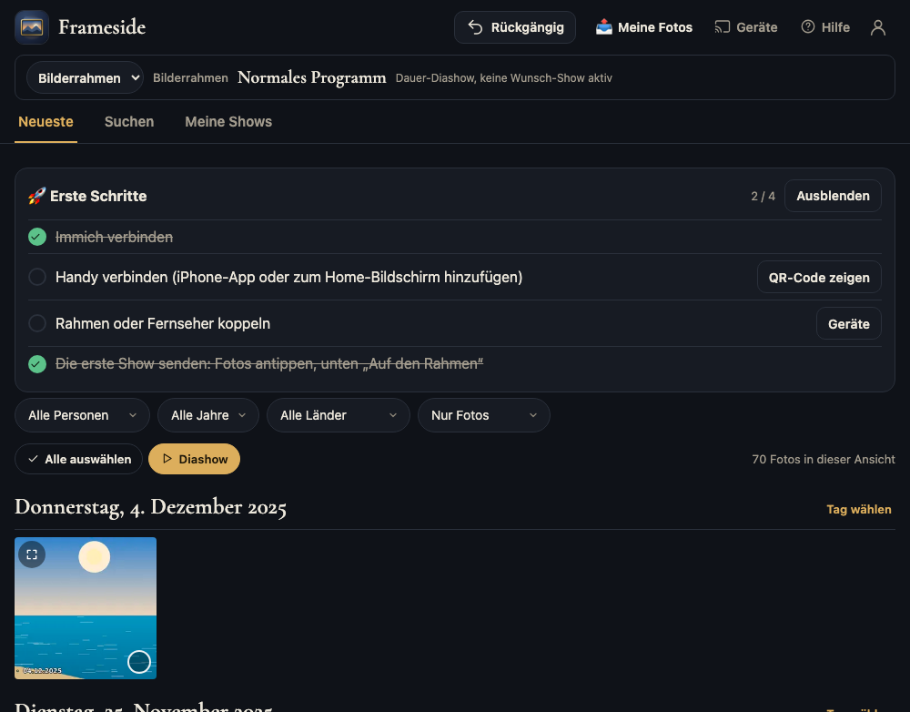


## 6. Alles in Ordnung? – Verbindung prüfen

Unter dem Konto-Symbol → **„Alles in Ordnung?“** prüft Frameside die Verbindung zu Immich, die Fotos und Schlüssel, Bildsuche, Upload und jedes Gerät. Hat etwas ein Problem, steht in Klartext dabei, was zu tun ist.


> Geräte, die sich „noch nie gemeldet“ haben, sind noch nicht gekoppelt. Sobald du sie koppelst (Abschnitt 4), wird der Punkt grün. Nicht mehr benötigte Geräte kannst du unter *Geräte* löschen.

## 7. iPhone-App „Frameside“ (optional)

Die App ist der bequemste Weg, Fotos zu senden, weil sie auch das Teilen-Menü, Siri-Kurzbefehle und ein Widget bietet.

1. App installieren und öffnen. Sie **sucht Server im WLAN selbst** und zeigt ihn unter „Gefunden im WLAN“. Ein Tipp genügt.

    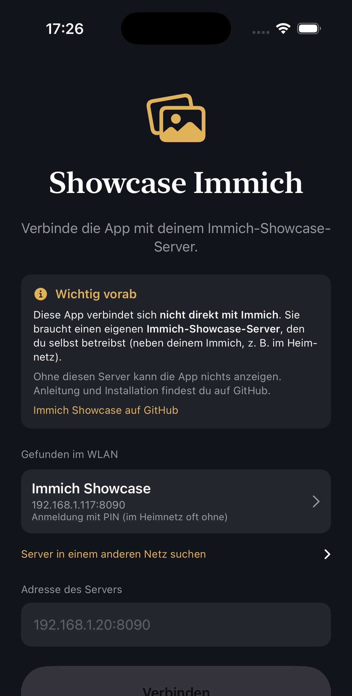

    Alternativ den **QR-Code** aus dem Assistenten (Schritt „Fertig“) scannen oder die Adresse von Hand eintragen.

2. Danach erscheint die gewohnte Oberfläche mit einem kurzen Rundgang. Wer keinen eigenen Server hat, kann den **Demo-Modus** ausprobieren.

    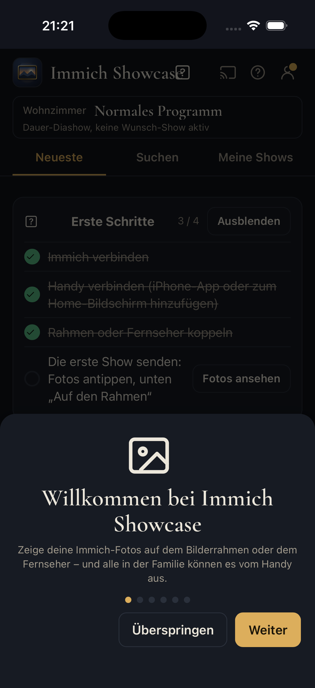

Face ID kann in den App-Einstellungen als zusätzlicher Schutz eingeschaltet werden, auch für die gespeicherte PIN.

---

## Wenn etwas nicht klappt

| Problem | Lösung |
|---|---|
| Einrichtungs-Link nicht erreichbar | Läuft der Container? `docker compose ps`. Port belegt? Mit `./install.sh --port 8091` neu starten. |
| Einrichtungs-Code vergessen | `docker compose logs showcase` zeigt ihn. |
| „Immich nicht erreichbar“ | Läuft Immich in einem anderen Docker-Netz? Dann im Assistenten die Adresse von Hand eintragen oder `SHOWCASE_IMMICH_NETWORK` in der `.env` setzen. |
| Tablet zeigt keinen Code | Stimmt die Adresse (mit Port)? Tablet und Server im selben Netz? |
| iPhone-App findet den Server nicht | „Server in einem anderen Netz suchen“ nutzen oder die Adresse eintragen. Beim ersten Start „Lokales Netzwerk“ erlauben. |
| Irgendetwas anderes | **„Alles in Ordnung?“** zeigt die Ursache in Klartext. |

## Aktualisieren

Frameside meldet selbst, wenn eine neue Version bereitsteht (in „Alles in Ordnung?“). Update:

```bash
docker compose pull && docker compose up -d
```

Wer es automatisch will, nutzt Watchtower (Vorlage in [`examples/watchtower`](../examples/watchtower)).
